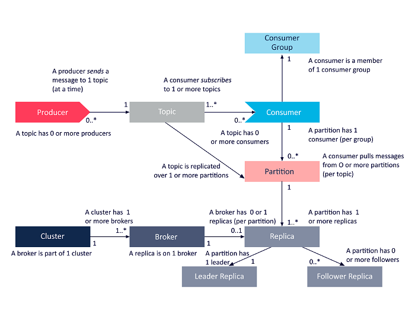

## Kafka e sistemas de mensageria/streaming distribuída

Doc: https://kafka.apache.org/documentation

È um streaming distribuida, que oferece 4 API's principais: o producer, o consumer,a api de fluxos e a api conector. 
Podendo enviar grandes volumes de dados e barramento para transferência de milhões de mensagens por segundo.

O Apache Kafka é usado principalmente para construir pipelines de dados em tempo real e aplicativos de streaming. Muito usado para Enfileiramento de mensagens,Transmissão de dados em tempo real,Agregação de logs, Origem de eventos, Integração de dados e ETL,Comunicação de microsserviços.

Ele atua como um sistema de mensagens pub/sub de alta performance.

Principais conceitos

- Producer: Um aplicativo que publica dados (mensagens) em tópicos do Kafka. Ele otimiza, serializa e balanceia mensagens entre partições.

- Consumer: Um aplicativo que assina tópicos do Kafka e lê mensagens de partições, normalmente dentro de um grupo de consumidores.

- Broker: Um servidor Kafka que gerencia o armazenamento de mensagens e processa solicitações de leitura/gravação. Os brokers trabalham juntos para formar um cluster Kafka.

- Topic: Um canal lógico que organiza mensagens. Os produtores escrevem sobre tópicos e os consumidores assinam.

- Partições: Uma subdivisão de um tópico que permite o processamento paralelo. Cada partição é replicada entre os brokers para tolerância a falhas.

- ZooKeeper: Coordena e gerencia brokers e clusters do Kafka, garantindo tolerância a falhas e eleições de líderes para partições.

- Replicação: Garante que cópias de partições sejam mantidas em diferentes brokers para melhorar a tolerância a falhas e a disponibilidade.. O fator de replicação definido define quantas cópias de um tópico são mantidas no cluster do Kafka. Ele é definido no nível do tópico e ocorre no nível da partição.
Por exemplo, um fator de replicação de 2 manterá 2 cópias de um tópico para cada partição.

- Consumer Group: Um grupo de consumidores compartilhando a carga de trabalho de processamento de mensagens de partições de um tópico, garantindo paralelismo.Se a quantidade de consumidores dentro de um grupo for maior que o número de partições, alguns consumidores ficarão inativos.

- Líder: O broker responsável por gerenciar todas as leituras e gravações de uma partição. Cada partição tem um líder a qualquer momento.

- Seguidor: brokers que replicam dados do broker líder para fins de redundância e failover.

O Kafka soluciona problemas comuns em sistemas distribuídos, fornecendo ordenação de conjuntos e processamento determinístico.

### Arquitetura de um cluster

Cluster é o paizão de tudo, ou seja, um cluster é composto por vários brokers que fazem balanceamento de carga, redundância e failover confiaveis. Os brokers utilizam o **Apache ZooKeeper®** para gerenciamento e coordenação do cluster, além disso é usado para eleger um lider. Cada instância do broker é capaz de lidar com volumes de leitura e gravação que chegam a centenas de milhares por segundo (e terabytes de mensagens) sem qualquer impacto no desempenho. 
Cada broker possui um ID exclusivo e pode ser responsável por partições de um ou mais logs de tópicos

Fator de replicação do tópico
A replicação de tópicos é essencial para projetar implantações do Kafka resilientes e altamente disponíveis.
Quando um broker fica inativo, réplicas de tópicos em outros brokers permanecem disponíveis para garantir que os dados permaneçam disponíveis e que a implantação do Kafka evite falhas e tempo de inatividade. 

### Resumo da relação entre componentes:

Os clusters do Kafka podem incluir um ou mais brokers.

Os brokers do Kafka podem hospedar várias partições.

Os tópicos podem incluir 1 ou mais partições.

Os brokers podem hospedar 1 ou zero réplicas para cada partição.

Cada partição inclui 1 réplica líder e zero ou mais réplicas seguidoras.

Cada uma das réplicas de uma partição precisa estar em um broker diferente.

Cada réplica de partição precisa caber completamente em um broker e não pode ser dividida em mais de um broker.

Cada broker pode ser o líder de zero ou mais pares de tópicos/partições.

### Vantagens

- Escalabilidade e desempenho : ofecere gravações sequências de alto desempenho e particiona tópicos para leituras e gravações altamente escaláveis. De que forma isso acontece? permitindo que múltiplos produtores e consumidores leiam e gravem simultaneamente (e em velocidades extremas).Com vários produtores gravando no mesmo tópico por meio de partições replicadas separadas, e vários consumidores de vários grupos de consumidores lendo também de partições separadas, é possível atingir praticamente qualquer nível de escalabilidade e desempenho desejados por meio dessa arquitetura eficiente

- Confiabilidade: A arquitetura Kafka alcança naturalmente o failover por meio do uso inerente de replicação. As partições de tópicos são replicadas em vários brokers, ou nós, do Kafka, com os tópicos utilizando um fator de replicação definido. A falha de qualquer broker do Kafka faz com que um ISR assuma a liderança dos seus dados e continue a atendê-los perfeitamente e sem interrupções.
