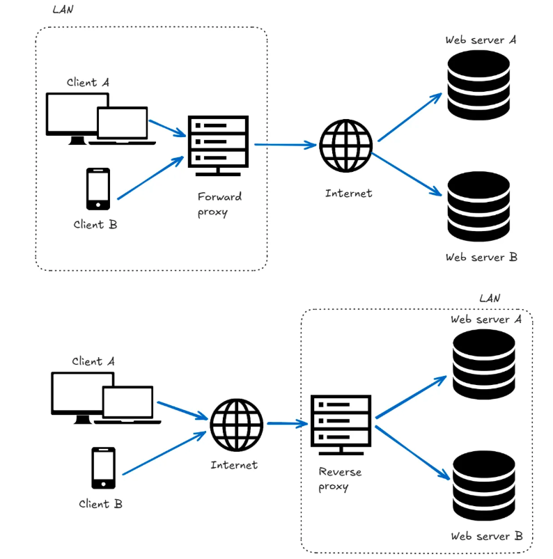

# Proxy

Funciona como um intermédiario entre cliente e servidor.Dessa forma, se o proxy estiver configurado corretamente, o servidor de destino não poderá ver o endereço IP original de onde a requisição foi iniciada, mas apenas o servidor proxy como origem assim como ao contrário também. 

Apesar do IP sozinho não ser tão importante para bloqueio como anti-bot as informações derivadas deles são muito importantes pois ele serve como histórico de uso para identificar ips que constumam está vinculado a spam ou bots, assim como associar sua localização para entender se são provinentes de nuvem ou de um provedor de internet local.

## Proxy reverso x encaminhamento(direto)

Proxy de encaminhamento: O proxy é posicionado após o cliente, antes que a solicitação possa acessar a Internet.

Proxy reverso: O proxy é posicionado após a solicitação acessar a internet, antes dos servidores web.

Diferenças 

- O proxy reverso é do lado do servidor, o de encaminhamento do cliente ou usuário final.
- A configuração é aplicada à máquina ou aplicativo cliente no caso do encaminhamento, no caso do reverso  a configuração é feita no servidor proxy e aos registros de DNS publico.
- Lógica central :

    - Encaminhamento: O proxy está configurado com regras para o tráfego de saída. Ele também pode exigir autenticação para identificar o usuário que faz a solicitação.

    - Reverso: O proxy é configurado com regras sobre o tráfego de entrada. Ele mapeia nomes de host e caminhos públicos para servidores de back-end internos.
- 

Resumo de uso:

Encaminhamento: Você usa um proxy de encaminhamento quando deseja controlar, monitorar ou mascarar o tráfego originado de um cliente ou grupo de clientes. Por exemplo, para anonimato e desbloqueio geográfico, ou para extração de dados da web em larga escala.

Proxy reverso: Você usa um proxy reverso quando deseja proteger, gerenciar e dimensionar seus serviços de backend. Por exemplo, como um balanceador de carga, escudo de segurança ou gateway de API.

### Proxy reverso

Funciona como o intermediário entre o servidor backend e o cliente com objetivo de proteger, de garantir a segurança e balancear os dados. 

#### Como funciona?

1. o cliente envia sua solicitação ao invés dela cair no servidor direto ela cai no proxy reverso.
2. Lá ele conhece o cliente com base com cookies e cabeçalho a origem da solicitação (incluindo se é um bot) e decide se vai enviar a solicitação pro servidor de origem ou vai usar dados do cache.
3. O proxy reverso envia para o servidor backend ( em casos de balanceamento ou alguma outra configuração é diferente).
4. O backend faz todo o processo ( calculo, consulta ao banco, chamada de api externa) e envia de volta para o proxy reverso.
5. O proxy salva uma cópia no cache e retorna a resposta pro cliente, caso o cliente faça a mesma solicitação ele não precisar enviar novamente ao backend.

A comunicação entre o proxy, os servidores web e outros serviços conectados fica completamente oculta para o cliente.

Beneficios 
- Proteção contra ataques cibernéticos: o proxy é a primeira camada protegendo back-end, o IP exposto é o do proxy.
- Todo o processo de criptografia de SSL também fica a cargo do proxy reverso.
- Uso de cache
- Balanceamento de carga para os casos de alto volume de solicitações.
- estratégias de implantação modernas como um lançamento canário onde parte dos usuáros tem acesso a uma determinada implantação enquanto outra parte ainda não.

### Proxy encaminhamento(direto)

#### Categorias

As categorias dos proxies são definidas pela origem do seu AP já que um IP pode derivar e obter muitas informações. Proxies transparentes , anônimos e de alto anonimato . Cada tipo oferece um nível diferente de ocultação da identidade e do endereço IP do usuário, impactando o grau de privacidade e segurança das atividades online.

- Proxies de data center: Fornecem IP's associados a servidores de data-centers ou seja eles não vão ser residenciais de provedores de internet serão proxies de empresas. Em geral são rápidos e confiáveis, lidam com grande volumes e com baixa latência. Olhando para scrapping funcionam muito bem em sites que não possuem medidas rigorosas.

- Proxies de ISP(Internet Service Provider): São hibridos entre os residenciais e de data-centers. São fornecidos por provedores de serviços de internet e, portanto, oferecem IPs residenciais legítimos porém são hospedados em data-centers.

- Proxies móveis: Sob o protocolo CGNAT, cada dispositivo móvel não recebe um endereço IP único. Em vez disso, vários dispositivos na mesma rede móvel recebem o mesmo endereço IP público, diferenciando-se apenas por números de porta exclusivos. Essa configuração aumenta significativamente o número de dispositivos que podem se conectar à internet, considerando a limitação de recursos de IP. Ao utilizarmos proxies móveis, aproveitamos redes onde centenas ou milhares de dispositivos compartilham endereços IP. Isso os torna particularmente difíceis de bloquear, já que banir um único endereço IP usado por um proxy móvel pode bloquear inadvertidamente centenas ou até milhares de usuários legítimos que compartilham esse endereço IP, levando a possíveis interrupções de serviço e insatisfação do usuário. É por isso que os proxies móveis são uma ótima opção para web scraping quando se enfrenta um sistema antibot robusto. 

- Os proxies residenciais utilizam endereços IP atribuídos por provedores de serviços de internet (ISPs) a residências reais. Isso lhes confere uma pontuação de confiança maior do que os proxies de data center, já que seus padrões de tráfego parecem originar-se de usuários finais legítimos

### Ref 

https://substack.thewebscraping.club/p/reverse-proxies-and-webscraping
https://substack.thewebscraping.club/p/everything-about-proxies
https://substack.thewebscraping.club/p/differences-residential-mobile-proxies